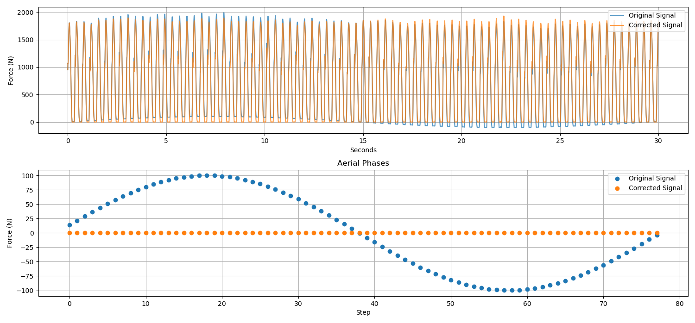

# `dryft`
#### Created by [Ryan Alcantara](https://alcantarar.github.io)

*Illustrated effect of using `dryft` to correct signal drift in vertical ground reaction force running data*

`dryft` is an open-source Python package that corrects running ground reaction force (GRF) 
signal drift. This package was developed for biomechanical researchers using force plates
or a force-measuring treadmill to collect an individual's GRF during running. Due to the
prevalence of MATLAB in the field of Biomechanics, I have also developed a [set of 
MATLAB functions](MATLAB) that operate like the Python package. However, this readme will 
focus on the use of the Python package.

## Table of Contents
* [Dependencies](#dependencies)
* [Recommended Installation](#recommended-installation)
* [How `dryft` Works](#how-dryft-works)
* [Using `dryft`](#using-dryft)
* [Contributing](#contributing)
* [Licensing](#licensing)

## Dependencies
This package was designed to work with and was tested with Python 3.6.7. 
Other python 3.X versions may be supported, provided dependency compatibilities and requirements are met.

The package requires the following dependencies: 
* numpy
* pandas
* matplotlib
* scipy

## Recommended Installation

I recommend using the [Anaconda](https://www.anaconda.com/distribution/#download-section) to setup a Python 3.6.7 
environment to use this package. If you wish to setup a new environment, an Anaconda [environment](environment.yml) 
file is included to automatically install most dependencies. To setup a new environment for `dryft`, type the following 
command into Anaconda Prompt:
```
conda env create -f path\to\environment.yml
```
This will create a new environment named `dryft-env`, which can be actived by typing:
```
conda activate dryft-env
```
Once the environment is setup and activated, `dryft` can be installed by cloning/downloading
this repository and then running:
```
python setup.py install
```

## How `dryft` works
Running is generally characterized by two phases: a stance and aerial phase. Only one foot is on the ground at a time during 
stance phase and both feet are off the ground during aerial phase. The force exerted by the body on the ground during 
aerial phase is zero and during stance phase it is greater than zero. If drift is present in the force signal, values 
during the aerial phase will no longer be zero. First, `dryft` calculates the force occurring during each aerial phase of
a continuous running trial. Then these aerial phase values are interpolated to the length of the trial using a 3rd order
spline fill. Lastly, the interpolated values, which represents the signal drift over time, are subtracted from the original 
trial. This effectively corrects for signal drift. A similar method is 
described by [Paolini *et al.* (2007)](https://www.ncbi.nlm.nih.gov/pubmed/16759895), but `dryft` does not assume a 
constant drift for a given step, instead interpolating between aerial phases. The `dryft` package differs from currently 
available signal correction methods, which can only 
account for [linear drift](https://docs.scipy.org/doc/scipy/reference/generated/scipy.signal.detrend.html) 
or a constant [offset](https://www.c-motion.com/v3dwiki/index.php/FP_ZERO).


## Using `dryft`
### Documentation
Please refer to the [documentation page](https://alcantarar.github.io/dryft/index.html)
### Example
The following tutorial and its supporting documents are found in `setup.py`, located in [sample](sample)
#### Read force signal data
The three-dimensional force data modified from [Fukuchi *et al* (2017)](https://peerj.com/articles/3298/). 
There is a sine wave with an amplitude of 100 Newtons and wavelength equal to trial length added to the force signal to 
simulate a variety of drift slopes. 
```
from dryft import signal, plot
import pandas as pd
from scipy.signal import butter, filtfilt
import matplotlib.pyplot as plt
import numpy as np

# Read in data from force plate
GRF = pd.read_csv('drifting_forces.txt', header=None)
```
#### Filter signal
Filtering data will improve step identification methods. Here I apply a zero-lag 4th order low pass butterworth
filter with a 60Hz cutoff.
```
# Apply Butterworth Filter
Fs = 600
Fc = 60
Fn = (Fs / 2)
b,a = butter(2, Fc/Fn)
GRF_filt = filtfilt(b, a, GRF, axis=0)  # filtfilt doubles order (2nd*2 = 4th order effect)
```

#### Identify where stance and aerial phases occur
Note the unusually high force threshold to define a stance phase (ideally <20 N). This will depend upon the amount of 
drift present in your signal. `GRF_filt[:,2]` is the vertical component of the ground reaction 
force signal (vGRF) and has an artificial drift of 100 Newtons, so a threshold of 110 Newtons 
will suffice for identifying stance phases. 

**After signal drift is corrected, be sure to run `signal.splitsteps()` on the detrended signal with a lower threshold!**

```
# Stance phase
stance_begin, stance_end = signal.splitsteps(vGRF=GRF_filt[:,2],
                                  threshold=110,
                                  Fs=300,
                                  min_tc=0.2,
                                  max_tc=0.4,
                                  plot=False)
# Plot stance phases
plot.stance(GRF_filt[:,2], stance_begin, stance_end)
```
#### Determine force signal during aerial phase
To calculate the force measured during aerial phase, `signal.aerialforce()` extracts the value that lies at the middle of 
the aerial phase. This ensures that no trailing values from the neighboring stance phases are included. 
```
# Determine force signal at middle of aerial phase (feet not on ground)
aerial_vals, aerial_loc = signal.aerialforce(GRF_filt[:,2], stance_begin, stance_end)

# Plot all aerial phases to see what is being subtracted from signal in signal.detrend()
plot.aerial(GRF_filt[:,2], aerial_vals, aerial_loc, stance_begin, stance_end)
```
#### Remove force signal drift
`signal.detrend()` first interpolates the aerial phase values to the length of the trial, and then subtracts it from the 
signal.
```
force_fd = signal.detrend(GRF_filt[:,2], aerial_vals, aerial_loc)
```
#### Plot results of `dryft`
```
# Compare detrended signal to original
stance_begin_d, stance_end_d = signal.splitsteps(vGRF=force_fd,
                                             threshold=10,
                                             Fs=300,
                                             min_tc=0.2,
                                             max_tc=0.4,
                                             plot=False)
aerial_vals_d, aerial_loc_d = signal.aerialforce(force_fd, stance_begin_d, stance_end_d)

# Plot waveforms (original vs detrended)plt.detrendp, (plt1, plt2) = plt.subplots(2, 1, figsize=(15, 7))
plt1.plot(np.linspace(0, force_fd.shape[0] / Fs, force_fd.shape[0]),
          GRF_filt[:,2],
          color='tab:blue',
          alpha=0.75,
          label='original signal')  # converted to sec
plt1.plot(np.linspace(0, force_fd.shape[0] / Fs, force_fd.shape[0]),
          force_fd,
          color='tab:orange',
          alpha=0.75,
          label='detrended signal')  # converted to sec
plt1.grid(zorder =0)
plt1.legend(loc=1)
plt1.set_xlabel('Seconds')
plt1.set_ylabel('force (N)')

# Plot aerial phases (original vs detrended)
plt2.set_title('Aerial Phases')
plt2.set_xlabel('Step')
plt2.set_ylabel('force (N)')
plt.scatter(np.arange(aerial_vals_d.shape[0]),
            aerial_vals,
            marker='o',
            color='tab:blue',
            label='original signal', zorder = 2)
plt.scatter(np.arange(aerial_vals.shape[0]),
            aerial_vals_d,
            marker='o',
            color='tab:orange',
            label='detrended signal', zorder = 2)

plt2.legend(loc=1)
plt.tight_layout()
plt2.grid(zorder = 0)
plt.show()
```
produces the following plot:


## Contributing

To report an problem with `dryft`, please create a new [issue](https://github.com/alcantarar/dryft/issues).

Contact [alcantarar](https://github.com/alcantarar) with any support or general questions about `dryft`. I also welcome
meaningful contributions via [pull requests](https://github.com/alcantarar/dryft/pulls).

## Licensing

This package is licensed under the MIT License. Copyright 2019 [Ryan Alcantara](https://alcantarar.github.io).
