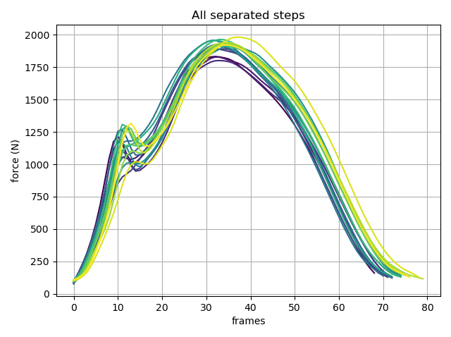
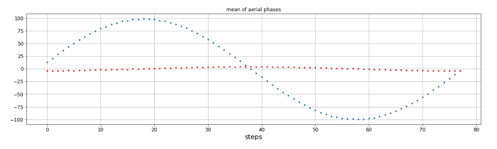

# Background
GRFs are the force exerted by the body on the ground during activities like walking and running. 
GRFs are clinically relevant and commonly measured in biomechanics.
To collect GRFs more easily, researchers use force plates and treadmills instrumented with force transducers.
Instrumented treadmills are special though, because they allow for the measurement of GRFs over long periods of time. 
However, force signals can be affected by changes in temperature or signal amplifiers, causing the signal to drift over time.
Signal drift, if ignored, can result in the loss of data if GRFs exceed the range of the force transducer. 

Even if a GRF signal does not exceed the range of the transducer, drift can still result in inaccurate data.
For example, signal drift can have additive effects on the measurement of stride kinematics like contact time during 
running. 
Contact time is the time the foot is in contact with the ground and is often defined as the duration when the vertical 
GRF is above a threshold.  
Signal drift can cause an increasing (or decreasing) amount of the vertical GRF signal to fall below the threshold, 
artificially increasing the variation in contact time or other time-dependent biomechanical variables (Figure 1).

*Figure 1. Vertical ground reaction force signal where signal drifts postiively 100 Newtons. 
Contact time increases by ~0.04s, or ~17%.* 
 
To combat signal drift, it is best practice to zero the force transducer signal between trials during data collection. 
This must be done when no force is being applied to the force transducers to ensure accurate signals.
However, zeroing of force transducers may not be feasible for protocols requiring extended periods of continuous
running on an instrumented treadmill, causing GRF signals to drift over time.
Signal drift is not unique to running biomechanics, as there are signal processing methods available to remove offsets 
[v3d] and linear drift [scipy/matlab detrend]. However, drift in GRF signals over time are not guaranteed to be
linear. 
Here, I introduce `dryft`, a Python and MATLAB package that is designed to remove non-linear drift in an individual's 
GRF signal during running by taking a stepwise approach. 

# Summary
During the aerial phase, the body is exerting no forces on the ground and we assume any forces measured by the 
instrumented treadmill are due to the motion of the belt or drift. 
A common method of correcting for drift and noise in the baseline signal is to subtract the forces measured during an 
aerial phase at the beginning of the recording and subtracting it from the raw force signal, effectively taring the 
signal (Visual3d FP_ZERO parameter). 
However, this method cannot account for changes in the direction or magnitude of drift within a given trial. 
Our stepwise approach tares each step individually by subtracting the mean of the aerial phase directly before and 
after the given step.

$$D_n = GRF_n - \frac{aerial_n + aerial_{n+1}}{2}$$

Where for step $n$, $aerial$ is the mean vertical GRF during the aerial phase, $GRF$ is the original 
signal, and D$ is the detrended signal. 
This process is repeated for all steps present in a trial, with GRF of the first and last step being estimated from 
an adjacent step's aerial phase.

# Citations

Citations to entries in paper.bib should be in
[rMarkdown](http://rmarkdown.rstudio.com/authoring_bibliographies_and_citations.html)
format.

For a quick reference, the following citation commands can be used:
- `@author:2001`  ->  "Author et al. (2001)"
- `[@author:2001]` -> "(Author et al., 2001)"
- `[@author1:2001; @author2:2001]` -> "(Author1 et al., 2001; Author2 et al., 2002)"

# Figures

Figures can be included like this: 

# Acknowledgements

The author would like to thank MRP for their support as well as GB and 
[/r/learnpython](https://reddit.com/r/learnpython) for their feedback during package development. 

# References